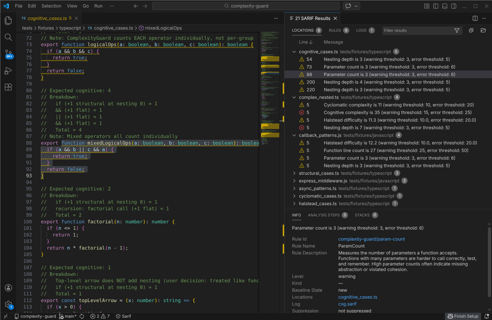
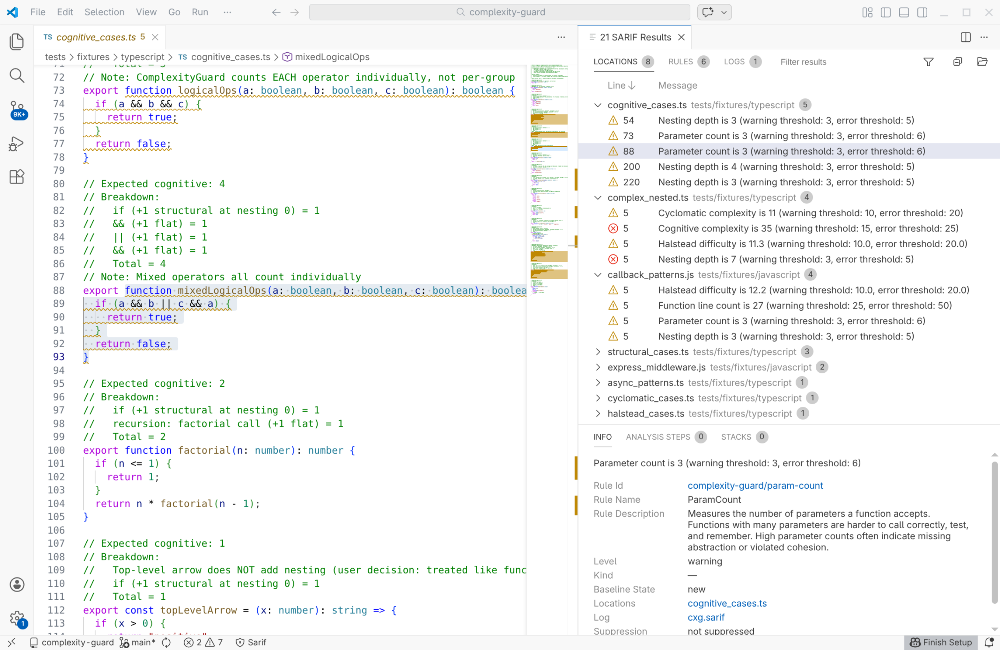
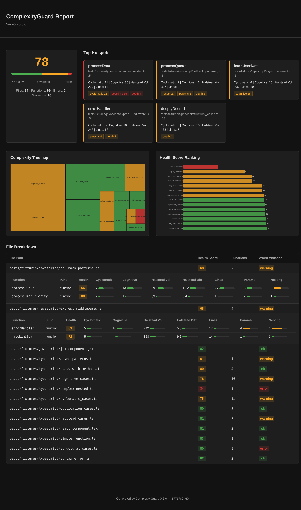

# ComplexityGuard

Fast complexity analysis for TypeScript/JavaScript — single static binary, zero dependencies.

## Quick Start

Install ComplexityGuard:

```sh
# npm (global install)
npm install -g complexity-guard

# Direct download (all platforms)
# Download the binary for your platform from GitHub releases:
# https://github.com/benvds/complexity-guard/releases
# Then make it executable and add to your PATH:
chmod +x complexity-guard
mv complexity-guard /usr/local/bin/
```

Run analysis on your codebase:

```sh
complexity-guard src/
```

Set up health score tracking (analyzes your code, suggests weights, saves baseline):

```sh
complexity-guard --init src/
```

## Example Output

```
src/auth/login.ts
  42:0  ✓  ok  Function 'validateCredentials' cyclomatic 3 cognitive 2
  67:0  ⚠  warning  Function 'processLoginFlow' cyclomatic 12 cognitive 18
              [halstead vol 843 diff 14.1 effort 11886] [length 34 params 3 depth 4]
  89:2  ✗  error  Method 'handleComplexAuthFlow' cyclomatic 25 cognitive 32
              [halstead vol 1244 diff 18.6 effort 23135 bugs 0.41] [length 62 params 4 depth 6]

Analyzed 12 files, 47 functions
Found 3 warnings, 1 errors
Health: 73

Top cyclomatic hotspots:
  1. handleComplexAuthFlow (src/auth/login.ts:89) complexity 25
  2. processPayment (src/checkout/payment.ts:156) complexity 18

Top cognitive hotspots:
  1. handleComplexAuthFlow (src/auth/login.ts:89) complexity 32
  2. processLoginFlow (src/auth/login.ts:67) complexity 18

Top Halstead volume hotspots:
  1. handleComplexAuthFlow (src/auth/login.ts:89) volume 1244
  2. processLoginFlow (src/auth/login.ts:67) volume 843

✗ 4 problems (1 errors, 3 warnings)
```

### SARIF Output in VS Code

<a href="docs/images/sarif-vscode-dark.png"></a>&nbsp;&nbsp;<a href="docs/images/sarif-vscode-light.png"></a>

### HTML Report

<a href="docs/examples/cxg.html"></a>

## Features

- **Cyclomatic Complexity**: McCabe metric counting independent code paths — measures testability
- **Cognitive Complexity**: SonarSource-based metric with nesting depth penalties — measures understandability
- **Halstead Metrics**: Information-theoretic vocabulary density, volume, difficulty, effort, and estimated bugs
- **Structural Metrics**: Function length, parameter count, nesting depth, file length, and export count
- **Duplication Detection**: Rabin-Karp rolling hash detects Type 1 and Type 2 code clones across files — enable with `--duplication` (see [duplication docs](docs/duplication-detection.md))
- **Composite Health Score**: Single 0–100 score combining all metric families with configurable weights — enforce in CI with `--fail-health-below`
- **Console + JSON + SARIF + HTML Output**: Human-readable terminal display, machine-readable JSON, SARIF 2.1.0 for GitHub Code Scanning, and self-contained HTML reports with interactive dashboard, treemap visualization, and sortable metric tables
- **Parallel Analysis**: Analyzes files concurrently across all CPU cores by default — use `--threads N` to control thread count or `--threads 1` for single-threaded mode
- **Configurable Thresholds**: Warning and error levels for all metric families, customizable per project
- **Selective Metrics**: Use `--metrics cyclomatic,halstead` to compute only specific families
- **Zero Config**: Works out of the box with sensible defaults, optional `.complexityguard.json` for customization
- **Single Binary**: No runtime dependencies, runs offline, fast startup — under 300ms on mid-size projects
- **Fast**: 1.5–3.1x faster than FTA with parallel analysis across all CPU cores (see [benchmarks](docs/benchmarks.md))
- **Low Memory Footprint**: 1.2–2.2x less memory than Node.js-based tools on small and medium projects (see [benchmarks](docs/benchmarks.md))
- **Error-Tolerant Parsing**: Tree-sitter based parser handles syntax errors gracefully, continues analysis on remaining files

## Documentation

- **[Getting Started](docs/getting-started.md)** — Installation, first analysis, configuration basics
- **[CLI Reference](docs/cli-reference.md)** — All flags, config options, exit codes
- **[Examples](docs/examples.md)** — Real-world usage patterns, CI integration recipes
- **[SARIF Output](docs/sarif-output.md)** — GitHub Code Scanning integration with inline PR annotations
- **[HTML Reports](docs/examples.md#html-reports)** — Self-contained interactive reports for sharing with stakeholders
- **[Performance Benchmarks](docs/benchmarks.md)** — Speed and memory comparison vs FTA across real-world projects
- **[Releasing](docs/releasing.md)** — Release process, publishing, version management

### Metrics

- **[Health Score](docs/health-score.md)** — Composite 0–100 score, formula, weights, and baseline + ratchet workflow
- **[Cyclomatic Complexity](docs/cyclomatic-complexity.md)** — Path counting for testability, ESLint-aligned rules
- **[Cognitive Complexity](docs/cognitive-complexity.md)** — Nesting-aware readability metric from SonarSource
- **[Halstead Metrics](docs/halstead-metrics.md)** — Vocabulary density, volume, difficulty, effort, estimated bugs
- **[Structural Metrics](docs/structural-metrics.md)** — Function length, parameters, nesting depth, file length, exports
- **[Duplication Detection](docs/duplication-detection.md)** — Rabin-Karp clone detection, Type 1/2 clones, thresholds (opt-in)

## Configuration

Create a `.complexityguard.json` file in your project root to customize behavior:

```json
{
  "files": {
    "include": ["src/**/*.ts", "src/**/*.tsx"],
    "exclude": ["**/*.test.ts", "**/*.spec.ts", "node_modules/**"]
  },
  "thresholds": {
    "cyclomatic": { "warning": 10, "error": 20 },
    "cognitive": { "warning": 15, "error": 25 },
    "halstead_volume": { "warning": 500, "error": 1000 },
    "halstead_difficulty": { "warning": 10, "error": 20 },
    "halstead_effort": { "warning": 5000, "error": 10000 },
    "halstead_bugs": { "warning": 0.5, "error": 2.0 },
    "function_length": { "warning": 25, "error": 50 },
    "params": { "warning": 3, "error": 6 },
    "nesting": { "warning": 3, "error": 5 },
    "file_length": { "warning": 300, "error": 600 },
    "exports": { "warning": 15, "error": 30 },
    "duplication": { "file_warning": 15.0, "file_error": 25.0, "project_warning": 5.0, "project_error": 10.0 }
  },
  "counting_rules": {
    "logical_operators": true,
    "nullish_coalescing": true,
    "optional_chaining": true,
    "switch_case_mode": "perCase"
  },
  "weights": {
    "cognitive": 0.30,
    "cyclomatic": 0.20,
    "halstead": 0.15,
    "structural": 0.15
  },
  "analysis": {
    "threads": 4,
    "duplication_enabled": false
  },
  "baseline": 73.2
}
```

See the [CLI Reference](docs/cli-reference.md) for complete configuration options.

## Building from Source

Requires [Zig](https://ziglang.org/) 0.14.0 or later:

```sh
zig build          # build binary to zig-out/bin/complexity-guard
zig build test     # run all tests
zig build run      # run the binary
```

The build produces a single static binary at `zig-out/bin/complexity-guard`.

## Rust Rewrite (In Progress)

A Rust rewrite is underway targeting 1:1 feature parity with the Zig binary. The Rust binary accepts the same CLI flags and produces identical output formats. To build from the Rust source:

```sh
cd rust && cargo build --release
```

The Rust binary will replace the Zig binary in a future release. Until then, the Zig binary remains the official distribution.

**Phase 20 (Parallel Pipeline) complete:** The Rust binary now discovers files, analyzes them in parallel using rayon, and produces sorted deterministic output. Running `complexity-guard .` against a directory performs full end-to-end analysis across all supported file types (`.ts`, `.tsx`, `.js`, `.jsx`).

## License

[MIT](LICENSE)
